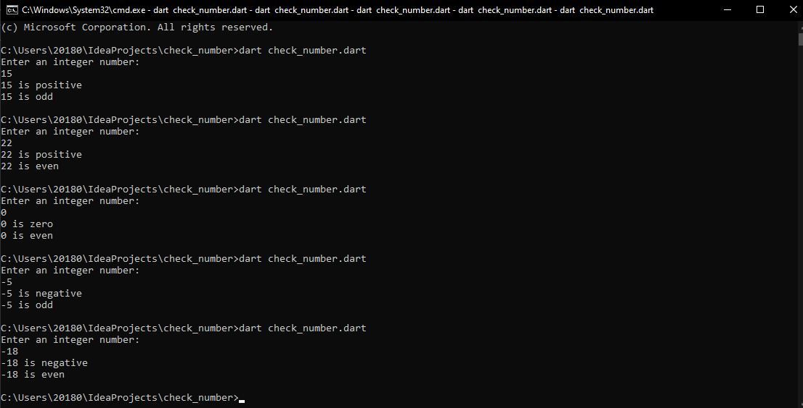

# Dart Number Checker

This project checks whether a given integer is positive or negative and whether it is even or odd using Dart. The program prompts the user to enter an integer and then evaluates the number based on the conditions.

## How to Run

1. Ensure you have Dart installed on your system.
2. Clone the repository.
3. Run the `check_number.dart` file using the Dart command: dart run check_number.dart

## Output

